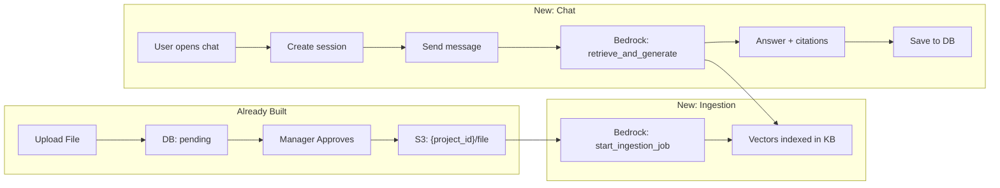
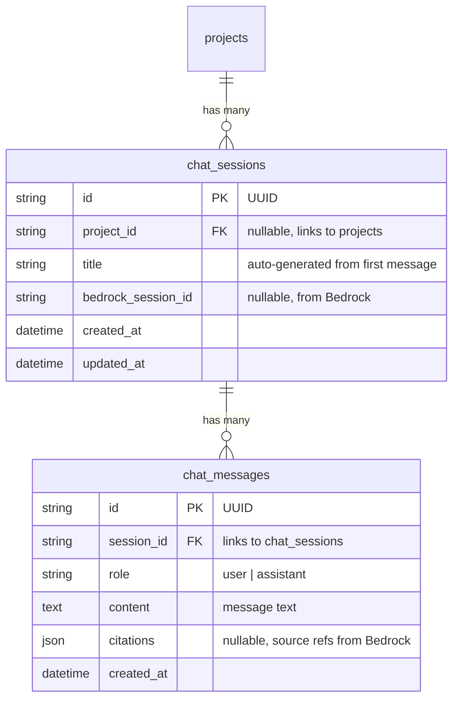
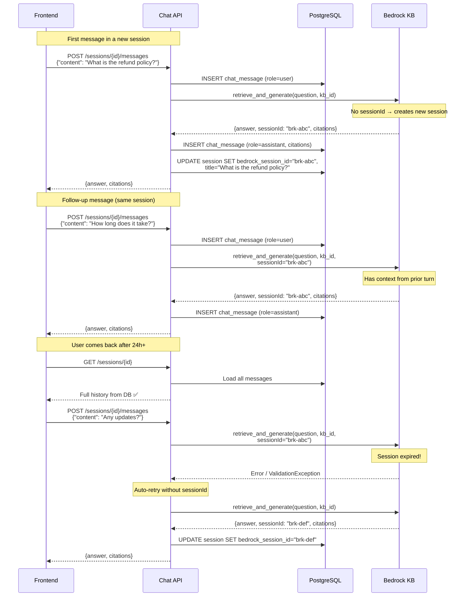

# Bedrock RAG Chat System — Implementation Plan

## 1. What We're Building

A session-based chat system that lets users ask questions about project documents. Documents uploaded through the knowledge base (and eventually meeting transcripts) are indexed in a **single global Amazon Bedrock Knowledge Base**. The chat uses Bedrock's `RetrieveAndGenerate` API to find relevant document chunks and generate answers with citations.

## 2. How It All Connects — End-to-End Flow



### The lifecycle of a document:

```
1. User uploads file          → raw bytes saved in DB (file_data column)
2. Manager approves           → background job fires
3. Background job             → uploads file to S3 at {project_id}/{file_id}_{filename}
4. After S3 upload succeeds   → triggers Bedrock start_ingestion_job  ← NEW
5. Bedrock indexes the file   → document chunks stored as vectors
6. User asks question in chat → Bedrock searches vectors, generates answer
```

### The lifecycle of a chat message:

```
1. User creates a chat session (tied to a project or global)
2. User sends a message
3. We save the user message to our DB
4. We call Bedrock retrieve_and_generate(question, kb_id, session_id)
   - First message: no session_id → Bedrock creates one, returns it
   - Follow-up messages: pass session_id → Bedrock has multi-turn context
5. We save the assistant response + citations to our DB
6. We update the session's bedrock_session_id
7. If it's the first message, auto-generate the session title
8. Return the answer to the frontend
```

## 3. Why Store Chat History in Our DB?

| | Bedrock Session | Our DB |
|---|---|---|
| **Lifetime** | ~24 hours, then expires | Permanent |
| **List sessions** | ❌ No API for this | ✅ Full CRUD |
| **Get history** | ❌ No API for this | ✅ Load all messages |
| **Multi-turn context** | ✅ Automatic | ❌ We'd have to rebuild prompts |

**Approach**: Use **both**. Bedrock `sessionId` for active multi-turn context. Our DB for permanent history + UI.

If a Bedrock session expires (user comes back after 24h), we simply start a fresh Bedrock session — the user's history is still intact in our DB.

## 4. Database Schema — 2 New Tables



**Migration SQL** (for existing DBs):
```sql
CREATE TABLE chat_sessions (
    id                  VARCHAR PRIMARY KEY,
    project_id          VARCHAR REFERENCES projects(id) ON DELETE SET NULL,
    title               VARCHAR(300) DEFAULT 'New Chat',
    bedrock_session_id  VARCHAR(200),
    created_at          TIMESTAMPTZ DEFAULT NOW(),
    updated_at          TIMESTAMPTZ DEFAULT NOW()
);

CREATE TABLE chat_messages (
    id          VARCHAR PRIMARY KEY,
    session_id  VARCHAR NOT NULL REFERENCES chat_sessions(id) ON DELETE CASCADE,
    role        VARCHAR(20) NOT NULL,
    content     TEXT NOT NULL,
    citations   JSON,
    created_at  TIMESTAMPTZ DEFAULT NOW()
);

CREATE INDEX idx_chat_sessions_project ON chat_sessions(project_id);
CREATE INDEX idx_chat_messages_session ON chat_messages(session_id);
```

## 5. API Endpoints

### Chat API — replacing the current single `/chat/ask`

| Method | Endpoint | Purpose |
|--------|----------|---------|
| `POST` | `/chat/sessions` | Create a new chat session |
| `GET` | `/chat/sessions` | List all sessions (filter by `?project_id=`) |
| `GET` | `/chat/sessions/{id}` | Get session + full message history |
| `POST` | `/chat/sessions/{id}/messages` | Send a message → get RAG answer |
| `DELETE` | `/chat/sessions/{id}` | Delete session + all messages |

### Request / Response Shapes

**Create session:**
```
POST /chat/sessions
Body:    { "project_id": "abc-123" }       ← optional
Returns: { "id", "project_id", "title": "New Chat", "created_at", "updated_at", "messages": [] }
```

**List sessions:**
```
GET /chat/sessions?project_id=abc-123      ← optional filter
Returns: [{ "id", "project_id", "title", "message_count", "created_at", "updated_at" }]
```

**Get session with history:**
```
GET /chat/sessions/{id}
Returns: { "id", "project_id", "title", "created_at", "updated_at",
           "messages": [{ "id", "role", "content", "citations", "created_at" }] }
```

**Send message (the main one):**
```
POST /chat/sessions/{id}/messages
Body:    { "content": "What decisions were made about the API redesign?" }
Returns: { "id", "role": "assistant", "content": "Based on the documents...", 
           "citations": [{"uri": "s3://...", "content": "snippet..."}], "created_at" }
```

**Delete session:**
```
DELETE /chat/sessions/{id}
Returns: 204 No Content
```

## 6. Message Flow — Detailed Sequence



## 7. Ingestion Trigger — After S3 Upload

When a file is approved and uploaded to S3, we need to tell Bedrock to re-index:

```
Existing flow:
  approve → S3 upload → save s3_key, clear file_data → DONE

New flow:
  approve → S3 upload → save s3_key, clear file_data → trigger_ingestion() → DONE
```

The `trigger_ingestion()` call is fire-and-forget. Bedrock processes it asynchronously (takes a few seconds to minutes depending on file size). The chat will find the new document once ingestion completes.

## 8. File-by-File Changes

### New Files

| # | File | What it does |
|---|------|-------------|
| 1 | `app/models/chat.py` | `ChatSession` and `ChatMessage` SQLAlchemy models |
| 2 | `app/services/bedrock_service.py` | `retrieve_and_generate()` and `trigger_ingestion()` wrappers |

### Modified Files

| # | File | What changes |
|---|------|-------------|
| 3 | `app/api/chat_api.py` | **Full rewrite** — replace single `/ask` endpoint with 5 session-based CRUD endpoints |
| 4 | `app/db/database.py` | Add `chat` to model imports in `init_db()` (1 line) |
| 5 | `app/api/knowledge.py` | Add `trigger_ingestion()` call in `_s3_upload_job` after S3 upload succeeds (~5 lines) |
| 6 | `.env` | Add 3 Bedrock placeholder env vars |

### NOT Changed

| File | Why |
|------|-----|
| `requirements.txt` | `boto3` already added (from S3 work) |
| `main.py` | Chat router already registered at `/chat` prefix |
| `app/models/knowledge.py` | Already has `file_data` and `s3_key` from S3 work |

## 9. Environment Configuration

```env
# Add to .env (fill in after creating KB in AWS)
BEDROCK_KB_ID=                  # Your Knowledge Base ID
BEDROCK_DATASOURCE_ID=          # Your S3 Data Source ID  
BEDROCK_REGION=us-west-2        # Region where KB lives
```

## 10. AWS Knowledge Base Setup Guide (do later, manually)

> [!NOTE]
> **You don't need to do this now.** When ready:
>
> 1. **AWS Console → Amazon Bedrock → Knowledge Bases → Create**
> 2. Pick an embedding model (e.g., **Titan Embeddings V2**)
> 3. Add an **S3 data source** → point to your S3 bucket (the one from `AWS_S3_BUCKET_NAME`)
> 4. Let it create a vector store (OpenSearch Serverless is default)
> 5. **Enable model access** for your preferred foundation model (e.g., Claude 3 Sonnet) in the Bedrock console
> 6. Copy the **Knowledge Base ID** and **Data Source ID** → paste into `.env`
> 7. You're done — the app will handle the rest

## 11. Error Handling

| Scenario | Behavior |
|----------|----------|
| Bedrock KB not configured (`BEDROCK_KB_ID` empty) | Returns a friendly error message, doesn't crash |
| Bedrock session expired (24h+) | Auto-retries without sessionId, starts fresh Bedrock session |
| Bedrock API error (permissions, quota) | Logs error, returns user-friendly failure message |
| Ingestion trigger fails | Logs error, doesn't block the S3 upload or approval |

## 12. Verification Plan

### After Implementation
- `python -c "from app.models.chat import ChatSession, ChatMessage"` — verify model imports
- `python -c "from app.services.bedrock_service import retrieve_and_generate"` — verify service imports
- Start server → verify new tables are created
- Test CRUD: create session → send message → get history → delete

### Manual Testing (after AWS KB setup)
- Upload + approve a file → verify ingestion job triggers in Bedrock
- Send a question in chat → verify RAG answer with citations
- Send a follow-up → verify multi-turn context works
- Wait 24h+ → verify session expiry handled gracefully
